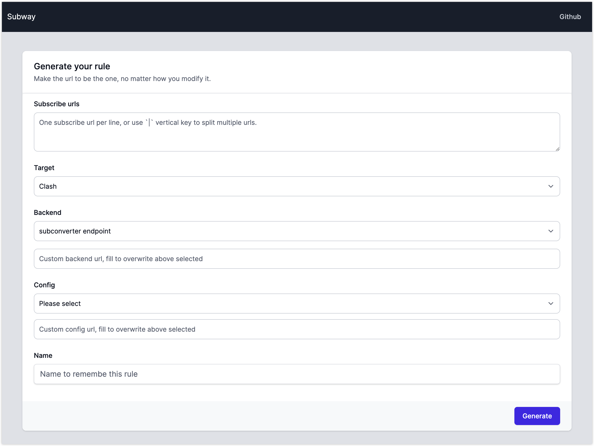

# 🚉 Subway

Take a train, way to home. Best solution for subconverter.

## Features

- 🤹‍♂️ Generate one unqiue url, use anywhere.
- 🔐 [Encrypt secret data](https://guides.rubyonrails.org/active_record_encryption.html), less leak from database.
- 🎫 Anonymous ticket, keep your privacy.
- 🔍 Open source, review user's safty.

## Usage

1. Customize rules and generate your coach.
1. Hold on to your ticket and get on the right number `Permalink`.
1. Update, destroy the coach with your ticket.

## Deploy

### Docker

1. Download [docker-compose.yml](https://raw.githubusercontent.com/0x5c3p73r/subway/main/docker-compose.yml) file
1. [Generate](https://subway-naf0.onrender.com/tools/encrypted_data) master key and encrypted data.
1. Copy master key to `RAILS_MASTER_KEY` and encrypted data to `RAILS_ENCRYPTED_DATA` in `docker-compose.yml`
1. Connect database
  1. Skip this step to use docker-compose's db service (default)
  1. Use external database, change the `DATABASE_URL` value.
1. Run it with `docker-compose up`
